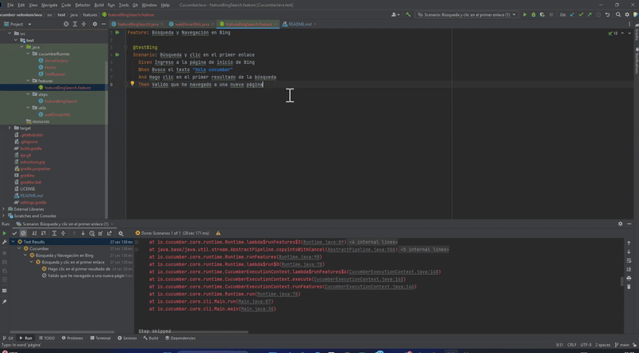

# 📂 Portafolio: Proyecto de Automatización Básico con Cucumber + Selenium

Este proyecto es una muestra simple de automatización de pruebas web utilizando el stack de **Cucumber, Java** y **Selenium WebDriver**. Está diseñado para demostrar la capacidad de crear tests legibles y mantenibles basados en el comportamiento (*Behavior-Driven Development* - BDD).



---
## 🚀 Requisitos y Ejecución

* **JDK (Java Development Kit): Versión 8 o superior.**

* **Gradle: El gestor de dependencias del proyecto.**

---

## 📁 Estructura del Proyecto

El proyecto sigue una estructura estándar de Cucumber + Selenium con Gradle:

```src
└── test 
├── java
│   ├── cucumberRunner
│   │   ├── CucumberRunner (Clase para ejecutar los tests)
│   │   ├── DriverFactory (Gestión del WebDriver)
│   │   └── Hooks (Configuración previa y posterior)
│   ├── features
│   │   └── featureBingSearch.feature (Archivos Gherkin)
│   ├── steps
│   │   └── featureBingSearch (Lógica de los pasos)
│   └── utils
│       └── webDriverUtils (Clase con utilidades de Selenium, como esperas y manejo de ventanas)
└── resources

```


## 📝 Caso de Prueba Demostrativo: Búsqueda en Bing

El proyecto incluye un escenario que simula una búsqueda y navegación en el motor de búsqueda Bing.

### Archivo `featureBingSearch.feature` (Gherkin)

```gherkin
Feature: Búsqueda y Navegación en Bing

  @testBing
  Scenario: Búsqueda y clic en el primer enlace
    Given Ingreso a la página de inicio de Bing
    When Busco el texto "Hola cucumber"
    And Hago clic en el primer resultado de la búsqueda
    Then Valido que he navegado a una nueva página
